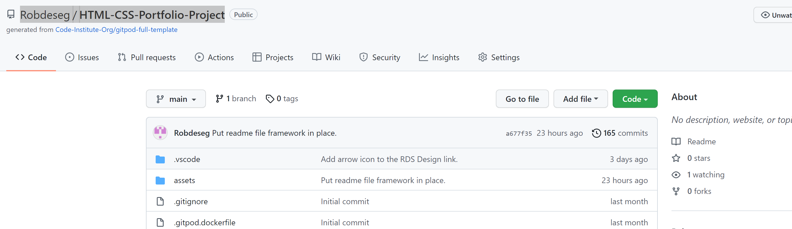

# Willem Platerink Photography

Willem Platerink is an internationally acclaimed photographer who specialises in African wildlife and culture. With over 20 years experience, he has, over that time, built a global following who are drawn to his unique style when it comes to capturing the beating heart of Africa and its people. His work has featured in print media in over 100 countries as well as exhibiting in some of the most renowed galleries in the world. This website has been designed as an extention of the photographer himself. It is an expression of the artit's style designed to bleed seemlessly through his work and back again. It is a place where collectors, exhibitors and dealers come together to look at work that has sold for several thousand dollars a piece. This is not designed to lasso an impulse purchases, rather it is built to emulate the experience of seeing Mr. Platerink's work in person.

<a href="https://robdeseg.github.io/HTML-CSS-Portfolio-Project/" target="_blank" rel="noopener">Willem Platerink Photography</a>

# Contents

* [**Tone and Inspiration**](<#tone-and-inspiration>)
* [**Features**](<#features>)
    * [**Landing Page**](<#landing-page>)
    * [**Header**](<#header>)
    * [**Home**](<#home>)
    * [**Selected Works**](<#selected-works>)
    * [**Fine Art**](<#fine-art>)
    * [**Fine Art Example**](<#fine-art-example>)
    * [**Exhibitions**](<#exhibitions>)
    * [**Contact**](<#landing-page>)
    * [**Footer**](<#footer>)
    * [**RDS Design**](<#rds-design>)
    * [**Future Amendments**](<#future-amendments>)
* [**Testing**](<#testing>)
    * [Browsers](<#browsers>)
    * [Responsivity](<#responsivity>)
    * [Functionality](<#functionality>)
    * [Bugs](<#bugs>)
    * [Validator Testing](<#validator-testing>)
        * [HTML](<#html)
        * [CSS](<#css)
        * [Accessibility](<#accessibility)
* [**Deployment**](<#deployment>)
* [**Credits**](<#credits>)

## Tone and Inspiration

    The tone and inspiration for the style and feel of the website came from two sources. The first being the photographer himself. I was lucky to be able to interview him at length and discuss both his work and his philosophies on life. These became important considerations when desiging the essence of the website and how it felt. The second, of course, are the photographs themselves, and these drove the overall aesthetic. It was important that his work sat within the pages of a site that looked seamless alongside them.

[Back to top](<#contents>)

## Features

    Form follows function. Always. And although that does not mean achieving one means compromising on the other, the overall UX was the principle consideration behind the design. The traffic through this site will be high net worth individuals who live in a world where everything works and works well. This drove the overriding goal of creating a simple and clean aesthetic, that is easy to use and intuitive.

 * ### Landing Page

    The landing page is designed to create the first and lasting impression of the kind of man Willem Platerink and, by extention, the sort of work he aims to create. There is an Entry button that takes you straight through to the Home Page, but equally, the site traffic here will not be rushing towards an impulse purchase. They are here to indulge in an artist and his work.

 * ### Header

    The header is clear, clean and simple. Each heading explains precisely what it is, while the header itslef lends a spacial awareness to where you are in the site. It operates as the compass to help steer you both forwards and backwards through each page of the site. 

    For the mobile phone screen size, it was decided that a dropdown menu would work better than simply shrinking the header menu further. This mantaines ease of access to each page even on a small screen.

 * ### Home

    The home page is the business and the brand wrapped into one and depicted fron tand center on the home page. It tells you what this site is and the kind of traffic it expects. It also establishes the framework of header and footer for each page that follows throughout the site for a sense of uniformity.

 * ### Selected Works

    Selected works are a carefully curated selection of the artist's work. On the bigger screens they are displayed in two rows, while on the smaller one just one so that the user can sensibly appreciate each image even on the tablet and mobile sized screens.

 * ### Fine Art

    Each photo presented by the artist is availible for purchase on a limited print run. This section aims to show you what to expect the finished, framed product to look like.

 * ### Fine Art Example

    This page is only accessible on the bigger screens to give the user a nice clear image of the artist's framed work. On smaller screens that image is displayed alongside the paragraph discussing the framing process. It is not expected that serious research before a purchase would take place on a smaller screened device.

 * ### Exhibitions

    This section can easily be changed every month to incorporate new and forthcoming exhibitions as and when they arise. 

 * ### Contact

    The contact section is designed to illustrate the international reach of the artist's work, while remaining true to the ethos of clean and simple functionality.

 * ### Footer

    Much like the header, the footer maintains the ethos of simplicity that runs throughout. There is a very simply form for those interested in joining the mailing list that requires only an email. The rest of the items all have their purpose without overfilling or cluttering the bottom of the site. 

 * ### RDS Design

    The link to the page for RDS Design is intentionally discreet. It is there without detracting from the main focus of the site. For those interested further, a simple form can be filled out on a seperate page. The website for RDS Design is under construction and a link to it will apear in further versions of this site. For now, the contact page for RDS Design is intentionally simple and inline with the aesthetic of the rest of the site so as not to jar.

 * ### Future Amendments

    It is intended that each photo in the Selected Works section will be clickable and once done so it will expand to fill the whole screen so that the user can see the level of detail that goes into each photograph.

    Privacy Policy and Terms & Conditions do not currently have any content and this will be added once the lawyers are satisfied with the content thereof.

[Back to top](<#contents>)

## Testing

 * ### Browsers

    The site has been fully tested across Chrome, Safari and Firefox and works well on each with no obvious issues.

 * ### Responsivity

    The site has been tested on standard sized screens across all platforms including mobile phone, tablet, laptop and two different sized desktop screens. Each page of the site proves fully responsive.

 * ### Functionality

    The site has been fully tested on several different subjects who found the navigation through the site to be straightforward and intuitive. Three repeating notes were to make the clickable links to return from RDS Design page to the website and to move from the Fine Art page to the Fine Art Example page more obvious. It was also suggested that the RDS Design tab in the footer be more obviously clickable. All three suggestions were addressed.

 * ### Bugs

    Bugs were generally small and resolved as part of the development process. 
    
    The validator testing threw up an issue with having a div as a child of a label element in the dropdown menu for mobile phones. This was resolved by using spans instead, achieving the same end result.

    Conversely, in the Contact section, it stated h3 elements are not allowed as child elements of a span. I changed the spans to div and again achieved the same result.

    It also said that the value of the attribute of one of the label elements in the Contact Form page needed to match the ID of a non-hidden form control. In this instance, I checked the label for="services-required" and the corresponding textarea id="services-required". They appeared to match. I copied and pasted one to the other to be sure and under further testing, no issues arose.

    Finally, there was an eroneous closing tab for an input field which was uncecessary and removed, as well as a stray end tag for a div in the Fine Art section which was also removed.

    * ### Unresolved Bugs

    On the index page for mobile phones only, there is a black line that appears above the photograph. It is not intended to be there, though currently I cannot work out how to remove it.

 * ### Validator Testing

    * #### HTML

        Save the one issue mentioned above, all pages returned the below report.

    

    * #### CSS

    

    * #### Accessibility

[Back to top](<#contents>)

## Deployment
    
 * #### This site was deployed to Github Pages using the following steps:

    1. First go to the project repository page [here.](https://github.com/Robdeseg/HTML-CSS-Portfolio-Project)
    2. From there, click on the Settings tab on the righthand side of the menu section across the top:
    
    3. Once you are in Settings, click on the Pages tab on the left, second from the bottom.
    
    4. You will then be in [Github Pages](https://github.com/Robdeseg/HTML-CSS-Portfolio-Project/settings/pages) where you will need to select the *Source*. From the *Branch* dropdown menu, choose *Main*.
    
    5. Once you click *Save* the site is deployed amd ready to share.
        

[Back to top](<#contents>)

## Credits

W3Schools helped with the arrangement of the photos into two columns in the selected works section using flexbox.

Coder Coder helped resolve the issue of amending the opacity of the background image (the globe) and not the text on top of it using ::before.

[Back to top](<#contents>)

 