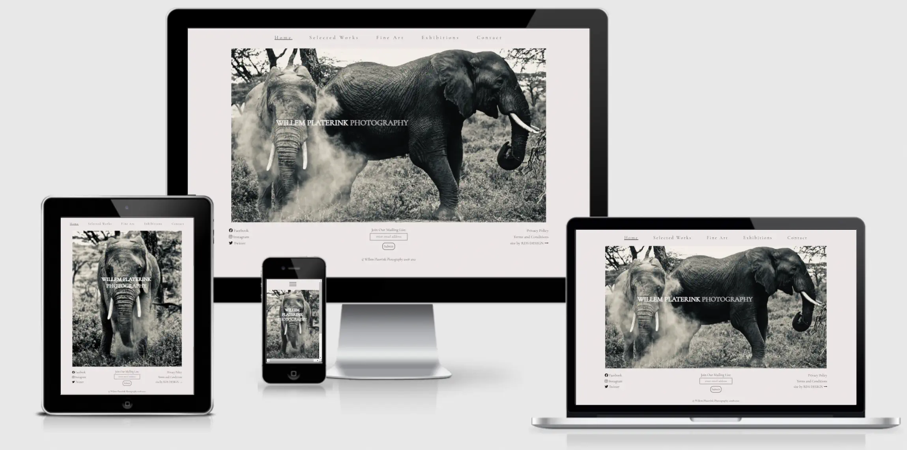

# Willem Platerink Photography

 Willem Platerink is an internationally acclaimed photographer who specialises in African wildlife and culture. With over 20 years’ experience, he has, during that time, built a global following who are drawn to his unique style when it comes to capturing the beating heart of Africa and its people. His work has featured in print media in over 100 countries as well as exhibiting in some of the most renowned galleries around the world. 

<a href="https://robdeseg.github.io/HTML-CSS-Portfolio-Project/" target="_blank" rel="noopener">Willem Platerink Photography</a>

# Contents

* [**User Experience**](<#user-experience>)
* [**Features**](<#features>)
    * [**Landing Page**](<#landing-page>)
    * [**Header**](<#header>)
    * [**Home**](<#home>)
    * [**Selected Works**](<#selected-works>)
    * [**Fine Art**](<#fine-art>)
    * [**Fine Art Example**](<#fine-art-example>)
    * [**Exhibitions**](<#exhibitions>)
    * [**Contact**](<#landing-page>)
    * [**Footer**](<#footer>)
    * [**RDS Design**](<#rds-design>)
    * [**Future Amendments**](<#future-amendments>)
* [**Testing**](<#testing>)
    * [Browsers](<#browsers>)
    * [Responsivity](<#responsivity>)
    * [Functionality](<#functionality>)
    * [Bugs](<#bugs>)
    * [Validator Testing](<#validator-testing>)
        * [HTML](<#html>)
        * [CSS](<#css>)
        * [Accessibility](<#accessibility>)
* [**Deployment**](<#deployment>)
* [**Technologies Used**](<#technologies-used>)
* [**Credits & Acknowledgements**](<#credits-&-acknowledgements>)

## User Experience

   This website has been designed as an extension of the photographer himself. It is an expression of the artist’s style intended to bleed seamlessly through his work and back again. It is a place where collectors, exhibitors and dealers come to look at work that has sold for several thousands of dollars apiece. TThe site has not been created to lasso an impulse purchase, rather it is built to emulate the experience of seeing Mr. Platerink's work in person.
    
   The tone and inspiration for this website came from two sources. The first being the photographer himself. I was lucky to be able to interview him at length and discuss both his work and his philosophies on life. These became important considerations when designing the essence of the website and how it felt. Specifically, the ethos of letting his subjects do the talking was a concept applied heavily to the site design. It is very much intended that his photographs take centre stage and the site and its functionality sit neatly behind them. 

   The second, of course, are the photographs themselves, and these drove the overall aesthetic in terms of colour choices and font, as well as the main design infastructure. Simplicity is key, underpinned by intuative functionality. It was important that his work sat within the pages of a site that looked seamless alongside them.

[Back to top](<#contents>)

## Features

   Form follows function. Always. And although that does not dictate that achieving one means compromising the other, the overall UX was the principal consideration when deciding how to present the site feautres. The traffic through this site will be high net worth individuals who live in a world where everything works and works well. The site functionality is designed to be no exception. 

 * ### Landing Page

    The landing page is there to create the first and lasting impression of the kind of man Willem Platerink is and, by extension, the sort of work that he creates. There is an Entry button that takes you straight through to the Home Page, but equally, visitors to the site will not be rushing towards an impulse purchase. They are here to indulge in an artist and his work and the quote on the landing page is there to set the tone.

 * ### Header

    The header is clear, clean, and simple. Each heading explains precisely what it is, while the header itself lends a spatial awareness to where you are within the site. It operates as the compass to help steer you both forwards and backwards through each page of the site. 

    For the mobile phone screen size, it was decided that a dropdown menu would work better than simply shrinking the header menu further. This maintains ease of access to each page even on a small screen.

 * ### Home

    The home page is the product and the brand wrapped into one and it is imperative to set the tone and style for the whole website from the moment the user sets foot on this page. It also establishes the framework of header and footer found on each page that follows throughout, guiding the user towards their own intuition.

 * ### Selected Works

    Selected works are a carefully curated selection of the artist's work. On the bigger screens they are displayed in two rows, while on the smaller one just one so that the user can sensibly appreciate the detail of each image on the tablet and mobile sized screens as well.

 * ### Fine Art

    Each photo presented by the artist is available for purchase on a limited print run. This section aims to show you what the finished, framed product will look like.

 * ### Fine Art Example

    This page is only accessible on the bigger screens to give the user a nice clear image of the artist's framed work. On smaller screens that image is displayed alongside the paragraph discussing the framing process. It is not expected that a serious buyer would view the work on a mobile-sized screen before initiating a purchase.

 * ### Exhibitions

    This section has been designed to be easily changed every month to incorporate new and forthcoming exhibitions as and when they arise. 

 * ### Contact

    The Contact section is designed to illustrate the international reach of the artist and his work, while remaining true to the ethos of clean and simple functionality.

 * ### Footer

    Much like the header, the footer aims for uniformity. There is a very simply form for those interested in joining the mailing list that requires only an email. The rest of the items all have their purpose without overfilling or cluttering the bottom of the site. 

 * ### RDS Design

    The link to the page for RDS Design is intentionally discreet. It is there without distracting from the focus of the site. For those interested in using RDS Design services, a form can be filled on a separate page. The website for RDS Design is under construction and a link to it will appear in future versions of this site. For now, the contact page for RDS Design has been kept simple and in line with the aesthetic of the rest of the site.

 * ### Future Amendments

    It is intended that each photo in the Selected Works section will be clickable and once done so, each image will expand to fill the whole screen so that the user can see the level of detail that goes into each photograph.

    The Privacy Policy and Terms & Conditions links do not currently have any content. This will be added in due course, once the lawyers have signed off on the appropriate wording.

[Back to top](<#contents>)

## Testing

 * ### Browsers

    The site has been fully tested across Chrome, Safari and Firefox and works well on each with no obvious issues.

 * ### Responsivity

    The site has been tested on standard sized screens across all platforms including iPhone 7, X, 12 & 13, iPad and iPad Pro, MacBook and MacBook Pro, Dell Inspiron, iMac and a Mac Mini as well as varying sized desktop screens. Each page of the site proves fully responsive.

 * ### Functionality

    The site has been tested on several different subjects who found the navigation through the site to be straightforward and intuitive. Three repeating notes were made suggesting the clickable links to return from RDS Design page to the main website and to move from the Fine Art page to the Fine Art Example page more obvious. The same applied to the RDS Design tab in the footer. All three suggestions were addressed.

 * ### Bugs

    Bugs were generally small and resolved as part of the development process. 
    
    1. The validator testing threw up an issue with having a div as a child of a label element in the dropdown menu for mobile phones. This was resolved by using spans instead.

    2. Conversely, in the Contact section it stated h3 elements are not allowed as child elements of a span. I changed the spans to divs and this was equally resolved.

    3. The value of the attribute of one of the label elements in the Contact Form page needed to match the ID of a non-hidden form control. In this instance, I checked the label for="services-required" and the corresponding textarea id="services-required". They appeared to match. I copied and pasted one to the other to be sure and under further testing, no issues arose.

    4. Finally, there was an erroneous closing tab for an input field which was unnecessary and removed, as well as a stray end tag for a div in the Fine Art section which was also removed.

    * ### Unresolved Bugs

    On the Index page on mobile phone-sized screens only, there is a black line that appears above the photograph. It is not intended to be there, though currently I cannot work out how to remove it.

 * ### Validator Testing

    * #### HTML

        Once the above issues were resolved, all pages returned the below report.

    

    * #### CSS

    

    * #### Accessibility

 The pages of the site achived 100% across the board for Accessibility, Best Practices and SEO on desktop platforms. Performance ranged between 98-100% on all pages except the Selected Works page which is very image heavy. While the images have been compressed, it did pull the Performance down to 67%.

 For mobile platforms, the SEO fell to 96% with the suggestion that the "tap targets" in the footer section are not appropriately sized. Having tested this on several subjects, I received no feedback that there were any issues when selecting those targets and therefore do not see this as a concern. Performace returned a figure of 65% on the Selected Works section for the same reason stated above, while all other pages corresponded to the results on the desktop platform.

THe Accessibility score remained at 100% throughout on both platforms.

[Back to top](<#contents>)

## Deployment
    
 * #### This site was deployed to Github Pages using the following steps:

    1. First, go to the project repository page [here.](https://github.com/Robdeseg/HTML-CSS-Portfolio-Project)
    2. From there, click on the Settings tab on the righthand side of the menu section across the top:
    
    3. Once you are in Settings, click on the Pages tab on the left, second from the bottom.
    
    4. You will then be in [Github Pages](https://github.com/Robdeseg/HTML-CSS-Portfolio-Project/settings/pages) where you will need to select the *Source*. From the *Branch* dropdown menu under the *Source* heading, choose *Main*.
    
    5. Once you click *Save* the site is deployed and ready to share.

* #### To create a clone of the project, use the following steps:

   1. Make sure you are signed into GitHub and GitHub Desktop and then go to the project repository page [here.](https://github.com/Robdeseg/HTML-CSS-Portfolio-Project)
   2. From there, click on the green *Code* button, and then, *Open with GitHub Desktop*.
   
   3. Click *Choose* and then, on your browser of choice, navigate to a local path where you would like to clone the repository. 
   4. Checking that the correct URL has successfully registered in the URL window, finally select *Clone*.

[Back to top](<#contents>)

## Technologies Used

   - HTML
   - CSS
   - [Gitpod](https://gitpod.io/)
   - [GitHub](https://github.com/)
   - [Google Fonts](https://fonts.google.com/)
   - [Compressor Pro](https://compressor.io/)
   - [Convertio](https://convertio.co/)

[Back to top](<#contents>)

## Credits & Acknowledgements

 W3Schools helped with the arrangement of the photos into two columns in the selected works section using flexbox.

 Coder Coder helped resolve the issue of amending the opacity of the background image (the globe) and not the text on top of it using ::before.

 https://coder-coder.com/background-image-opacity

 The navigation dropdown bar for mobile phone sized screns was taken from the following site, though amendments were made (mentioned above) to make it pass validation checks.

 https://codepen.io/ngochuynh/pen/yKrvVZ

 I used Robin Schreiner's work at pexels.com for an image of a photo gallery for the background of the Exhibition page.

 https://www.pexels.com/photo/wooden-bench-2261165/

 And finally, I would also like to thank the tutors, mentors and allumni at Code Institute for their advice and support throughout the development of this website. It has been invaluable.

 © Robert de Segundo 2021

[Back to top](<#contents>)

 